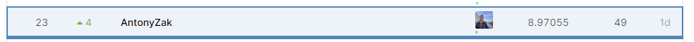

# MADE_CV_Contest_1
Repository for kaggle competition "Thousand Facial Landmarks" within MADE Computer Vision course

My solution is based on the baseline code from the competition authors


```diff
Run script: python .\train.py
```

**LB score screen:**


**Place in LB score screen:**



**My main steps**
* Train routine: 
  * Network selection (ResNet, ResNeXt, Inception etc);
  * Learning rate selection;
  * Selection number of epochs in range (1, 12);
  * Attempts to add new fc layers with regularization to the pretrained model.
* Work with dataset:
  * Train size selection (has optimal value);
  * Image input size selection (SCALE_SIZE, CROP_SIZE);
  * Selection between RandomCrop and CenterCrop;
  * Add Grayscale transform;
  * Add ColorJitter(brightness) transform.
