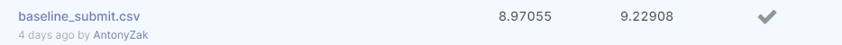

# MADE_CV_Contest_1
# Repository for kaggle competition "Thousand Facial Landmarks" within MADE Computer Vision course

How to run script: python .\train.py

**LB score screen:**


```diff
- text in red
+ text in green
! text in orange
# text in gray
```
